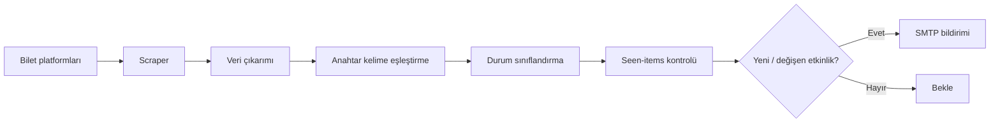

# Bilet Takip

Bilet Takip; çeşitli etkinlik platformlarındaki konser ve spor bileti duyurularını izleyen, eşleşen etkinlikleri sınıflandıran, daha önce görülen sonuçları takip eden ve gerektiğinde e-posta bildirimi oluşturabilen Python tabanlı bir takip aracıdır.

## Nasıl çalışır?



## Özellikler

- Biletinial, Bubilet, Biletix ve Passo sayfalarını tarama
- Sanatçı ve takım anahtar kelimelerine göre etkinlik eşleştirme
- Satışta, yakında satışta ve tükenmiş durumlarını ayırt etme
- Şehir, tarih, saat ve mekân bilgilerini çıkarma
- Daha önce görülen etkinlikleri JSON tabanlı durum kaydıyla takip etme
- SMTP üzerinden e-posta bildirimi oluşturma
- Kimlik bilgilerini kaynak kod yerine ortam değişkenlerinden alma

## Teknolojiler

Python 3.11, Requests, Beautiful Soup, SMTP, JSON tabanlı yerel state ve GitHub Actions altyapısı.

## Proje yapısı

```text
.
├── ticket_notifier.py   # Tarama, eşleştirme ve bildirim işlemleri
├── requirements.txt     # Python bağımlılıkları
├── README.md
└── seen_items.json      # İlk çalıştırmada oluşur; Git tarafından takip edilmez
```

## Yerel kurulum

```bash
python -m venv .venv
```

Linux/macOS:

```bash
source .venv/bin/activate
pip install -r requirements.txt
```

Windows PowerShell:

```powershell
.venv\Scripts\Activate.ps1
pip install -r requirements.txt
```

## Yapılandırma

| Değişken | Açıklama |
|---|---|
| `SMTP_HOST` | SMTP sunucusu |
| `SMTP_PORT` | SMTP portu |
| `SMTP_USER` | Gönderen e-posta adresi |
| `SMTP_PASS` | Uygulama şifresi veya SMTP parolası |
| `MAIL_TO` | Bildirimin gönderileceği adres |

Ardından:

```bash
python ticket_notifier.py
```

`seen_items.json` ilk çalıştırmada otomatik oluşturulur ve `.gitignore` kapsamında tutulur.

## Güvenlik

SMTP parolaları, API anahtarları veya diğer kimlik bilgileri kaynak koduna yazılmamalıdır. Yerel kullanımda ortam değişkenleri, CI ortamında ise repository secret mekanizması kullanılmalıdır. Web scraping yapılan platformların HTML yapıları zaman içinde değişebileceği için parser davranışı düzenli olarak doğrulanmalıdır.

## Proje durumu

Tarama ve yerel bildirim altyapısı portföy amacıyla korunmaktadır. Repository'deki zamanlanmış GitHub Actions otomasyonu şu anda devre dışıdır; bu nedenle depo kendi başına periyodik tarama veya e-posta gönderimi başlatmaz. Yerel çalıştırma yukarıdaki yapılandırma ile yapılabilir.
